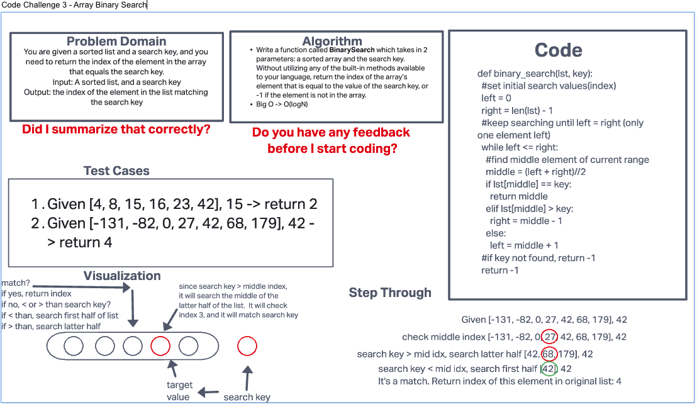

# Create Binary Search Function for sorted list
Write a function called BinarySearch which takes in 2 parameters: a sorted array and the search key.
Without utilizing any of the built-in methods available to your language, return the index of the array’s
element that is equal to the value of the search key, or -1 if the element is not in the array.

## Whiteboard Process

## Approach & Efficiency
I used a while loop. While there are more than 1 elements left in the list, keep searching (unless you find the match).
Search middle element, if it matches, return the index of that element. Search left or right half of list depending on
if search key is less than or greater than middle value, until the middle (or last remaining) element = search key

Big O would be O(logN) I think. Steep increase at first in both time and space needed, but it would taper off.
