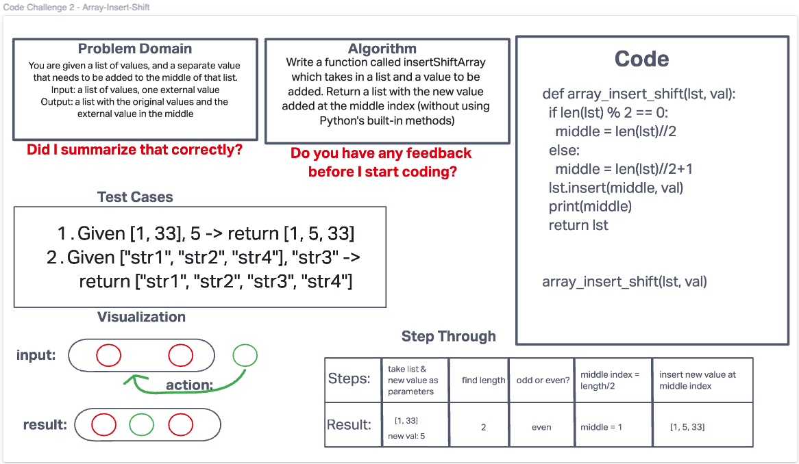

# Insert to Middle of an Array
Write a function called insertShiftArray which takes in an array and a value to be added.
Without utilizing any of the built-in methods available to your language, return an array
with the new value added at the middle index.

Stretch Goal:
Write a second function that removes an element from the middle index and shifts other
elements in the array to fill the new gap.

## Whiteboard Process

## Approach & Efficiency
<!-- What approach did you take? Discuss Why. What is the Big O space/time for this approach? -->
