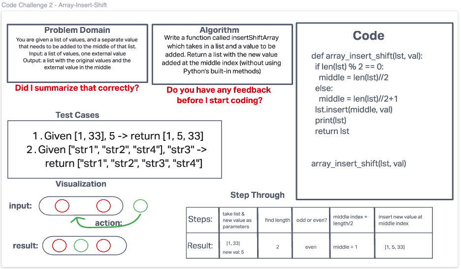

# Insert to Middle of an Array
Write a function called insertShiftArray which takes in an array and a value to be added.
Without utilizing any of the built-in methods available to your language, return an array
with the new value added at the middle index.

Stretch Goal:
Write a second function that removes an element from the middle index and shifts other
elements in the array to fill the new gap.

## Whiteboard Process

## Approach & Efficiency
I found the length of the given list, divided by 2 to find the middle gap between elements
(if there was an odd number of elements, the middle spot would be after the middle element).
Then insert the given value into the middle spot in the list.
Big O would be O(1) I think. It's still only 2 steps no matter the length of the list: find middle, insert.
