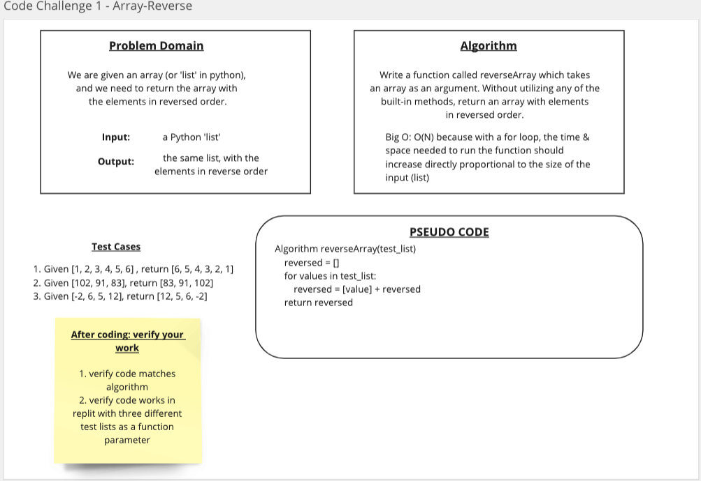

# Reverse an Array
Take a list, and return another list with the elements from the first list in reverse order.

## Whiteboard Process

## Approach & Efficiency
<!-- What approach did you take? Discuss Why. What is the Big O space/time for this approach? -->
I used a for loop for this challenge, it seemed like the simplest way to do it. The Big O for the function would be O(N) - linear growth.

