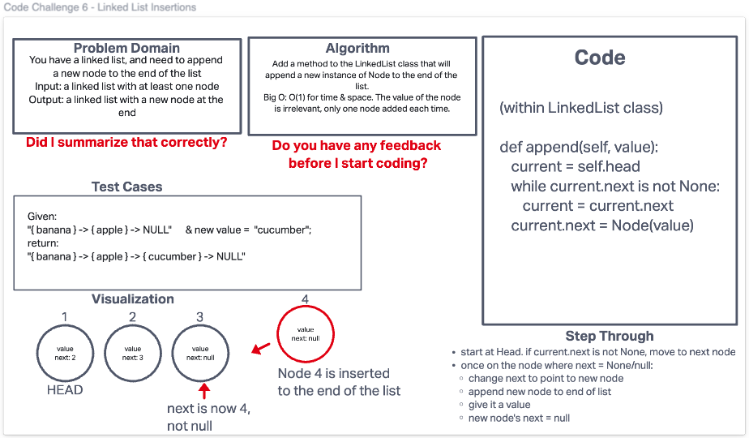

# Append a new node to the end of a linked list
Using the LinkedList class we built for code challenge 5, create a new method to append a new node to the end of a
linked list.

## Whiteboard Process

## Approach & Efficiency
Traverse through the linked list, starting at the Head. While the current node's 'next' property is not null,
move to the next node in the list. Once you arrive at the node whose 'next' property is null, add a new node
to the end of the list, and set current.next (for the node that was previously the last node) to point to the new node.
