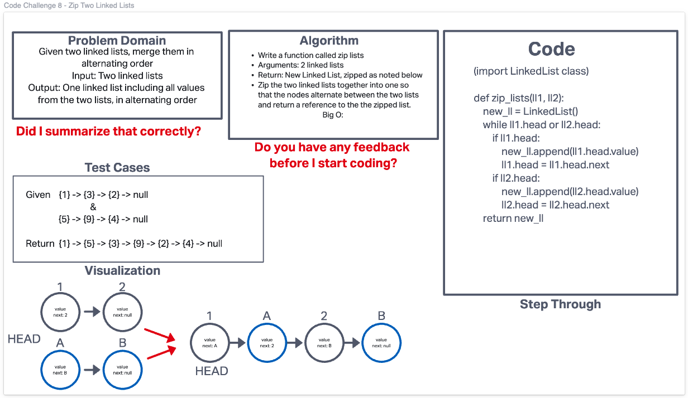

# Zip Two Linked Lists
Using the LinkedList class we built for code challenge 5:
- Write a function called zip lists
- Arguments: 2 linked lists
- Return: New Linked List, zipped as noted below
- Zip the two linked lists together into one so that the nodes alternate between the two lists and return a reference to the the zipped list.
- Try and keep additional space down to O(1)

## Whiteboard Process

## Approach & Efficiency

## Link to Code
[Zip Two Linked Lists](/code_challenges/linked_list_zip.py)
