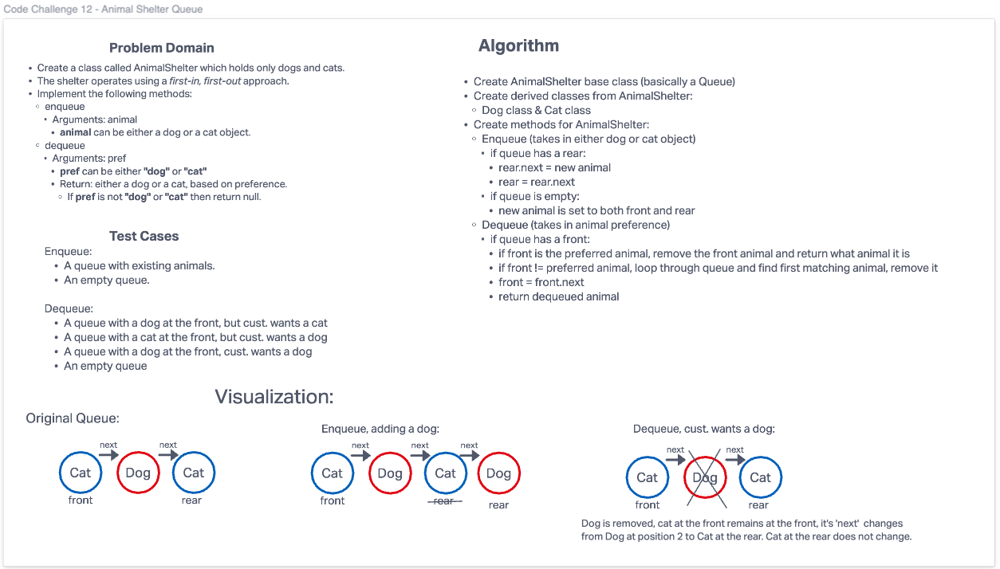

# Challenge Summary
- Create a class called AnimalShelter which holds only dogs and cats.
- The shelter operates using a first-in, first-out approach.
- Implement the following methods:
  - enqueue
    - Arguments: animal
      - animal can be either a dog or a cat object.
  - dequeue
    - Arguments: pref
      - pref can be either "dog" or "cat"
    - Return: either a dog or a cat, based on preference.
      - If pref is not "dog" or "cat" then return null.

## Whiteboard Process

## Approach & Efficiency
Big O: Time - O(n) linear increase based on length of queue. Space - O(1) constant, only evaluating one 'node' at a time.

## Solution
- [Link to Code](/code_challenges/stack_queue_animal_shelter.py)
