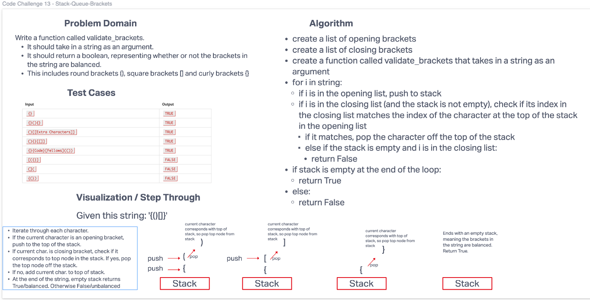

# Challenge Summary
- Write a function called validate_brackets.
  - It should take in a string as an argument.
  - It should return a boolean, representing whether or not the brackets in the string are balanced.
  - This includes round brackets (), square brackets [] and curly brackets {}

## Whiteboard Process

## Approach & Efficiency
- I used a stack to push the opening brackets onto as I loop through the string. If I come across a closing bracket during the loop, I will check if the closing bracket corresponds to the opening bracket at the top of the stack. If yes, pop off top bracket. Empty stack at the end of the string returns True, otherwise False.
- Big O:
  - Time: O(n) - linear increase based on the length of the string.
  - Space: O(n) - also linear; the stack holds the contents of the string.

## Solution
[Link to Code](/code_challenges/stack_queue_brackets.py)

## Thanks / Credit
- Thanks to Dylan Cabral for the extra unit tests
