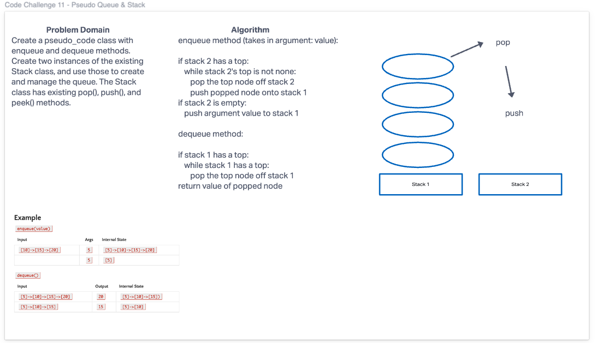

# Pseudo Queue
Create a new class called pseudo queue.
Do not use an existing Queue.
Instead, this PseudoQueue class will implement our standard queue interface (the two methods listed below),
Internally, utilize 2 Stack instances to create and manage the queue
Methods:
enqueue
Arguments: value
Inserts a value into the PseudoQueue, using a first-in, first-out approach.
dequeue
Arguments: none
Extracts a value from the PseudoQueue, using a first-in, first-out approach.

## Whiteboard

## Solution

enqueue method (takes in argument: value):

if stack 2 has a top:
	while stack 2's top is not none:
		pop the top node off stack 2
		push popped node onto stack 1
if stack 2 is empty:
	push argument value to stack 1

dequeue method:

if stack 1 has a top:
	while stack 1 has a top:
		pop the top node off stack 1
return value of popped node
