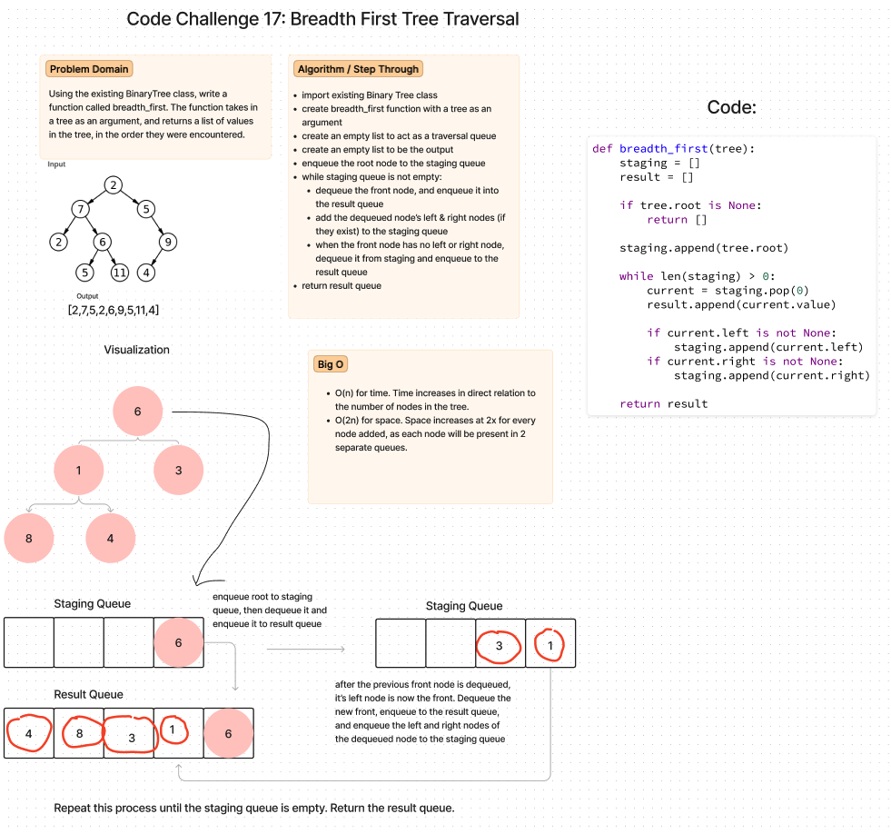

# Breadth First Tree Traversal
- Write a function called breadth first
- Arguments: tree
- Return: list of all values in the tree, in the order they were encountered

## Whiteboard Process


## Approach & Efficiency
- O(n) for time. Time increases in direct relation to the number of nodes in the tree. 
- O(2n) for space. Space increases at 2x for every node added, as each node will be present in 2 separate queues.

## Solution
```
def breadth_first(tree):
    staging = []
    result = []

    if tree.root is None:
        return []

    staging.append(tree.root)

    while len(staging) > 0:
        current = staging.pop(0)
        result.append(current.value)

        if current.left is not None:
            staging.append(current.left)
        if current.right is not None:
            staging.append(current.right)

    return result
```